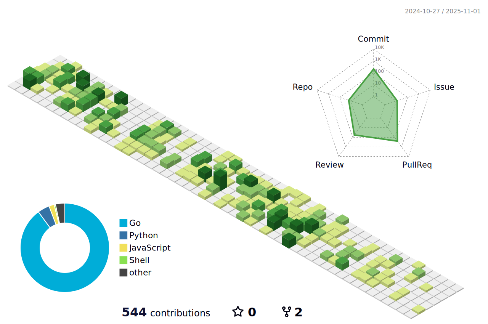

<h1 align="center">Hi 👋, I'm 张祖建</h1>

- 🔭 I’m currently working on [**Kube-OVN**](https://github.com/kubeovn/kube-ovn)

<h3 align="left">Languages and Skills</h3>

<h3 align="left">Contributions</h3>

<h3 align="left">Contact Me</h3>

